## Cards

| Name | Image | Upgraded image | Rarity | Type | Cost | Description |
| ---- | ----- | -------------- | ------ | ---- | ---- | ----------- |
| 三明治 |  |  | Special | 技能 | 0 | 获得 3(6) 点 临时力量 。 消耗 。 |
| 侧身 | 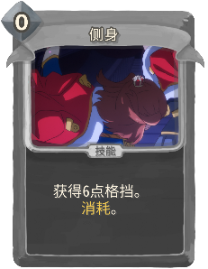 |  | Special | 技能 | 0 | 获得 6(12) 点 格挡。 消耗 。 |
| 保留力量 |  |  | Special | 技能 |  | 保留力量 1(2) 回合。 |
| 保留手牌 | 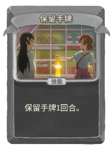 |  | Special | 技能 |  | 保留手牌 1(2) 回合。 |
| 保留格挡 |  | 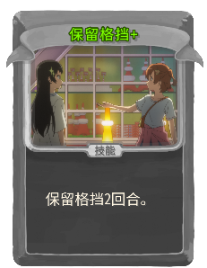 | Special | 技能 |  | 保留格挡 1(2) 回合 。 |
| 保留能量 |  |  | Special | 技能 |  | 保留能量 1(2) 回合。 |
| 回击 |  | 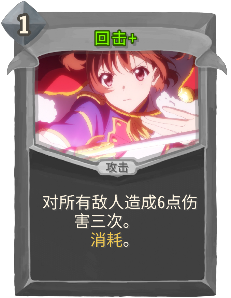 | Special | 攻击 | 1 | 对所有敌人造成 4(6) 点伤害三次。 消耗 。 |
| 对峙 |  |  | Special | 攻击 | 1 | 造成 4 点伤害 3(4) 次。 消耗 。 |
| 弃牌堆 | 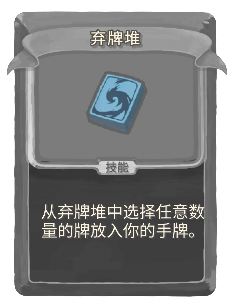 |  | Special | 技能 |  | 从 弃牌堆 中选择 2 张牌放入你的手牌。 |
| 弃牌堆 |  | 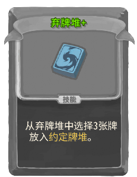 | Special | 技能 |  | 从 弃牌堆 中选择 2(3) 张牌放入 约定牌堆 。 |
| 弃牌堆 |  |  | Special | 技能 |  | 从 弃牌堆 中选择任意数量的牌放入你的手牌。 |
| 手牌 |  |  | Special | 技能 |  | 从 手牌 中选择 2(3) 张牌放入 约定牌堆 。 |
| 抽牌堆 |  | 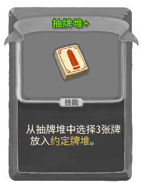 | Special | 技能 |  | 从 抽牌堆 中选择 2(3) 张牌放入 约定牌堆 。 |
| 抽牌堆 |  |  | Special | 技能 |  | 从 抽牌堆 中选择任意数量的牌放入你的手牌。 |
| 抽牌堆 |  |  | Special | 技能 |  | 从 抽牌堆 中选择 2 张牌放入你的手牌。 |
| 约定之塔 | 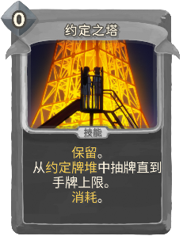 |  | Special | 技能 | 0 | 保留 。 从 约定牌堆 中抽牌直到手牌上限。 消耗 。 (not 消耗 。) |
| 约定牌堆 | 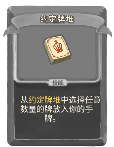 |  | Special | 技能 |  | 从 约定牌堆 中选择 2 张牌放入你的手牌。 |
| 约定牌堆 |  |  | Special | 技能 |  | 从 约定牌堆 中选择任意数量的牌放入你的手牌。 |
| 续演 | 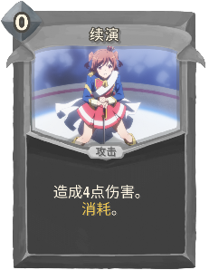 |  | Special | 攻击 | 0 | 造成 4(6) 点伤害。 消耗 。 |
| 困意 |  |  | Special | 诅咒 |  | 不能被打出 。 虚无 。 不能从牌组中移除。 |
| 坠落 |  | 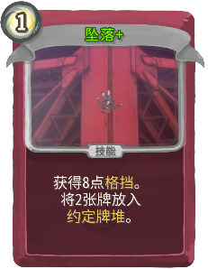 | Basic | 技能 | 1 | 获得 8 点 格挡 。 将 1(2) 张牌放入 约定牌堆 。 |
| 打击 | 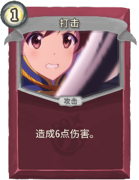 |  | Basic | 攻击 | 1 | 造成 6(9) 点伤害。 |
| 闪耀打击 | 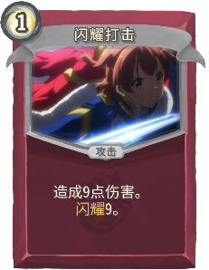 | 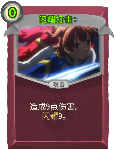 | Basic | 攻击 | 1(0) | 造成 9 点伤害。 |
| 防御 |  | 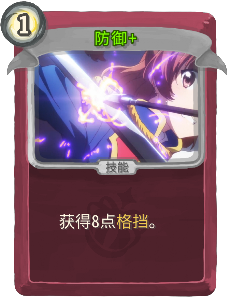 | Basic | 技能 | 1 | 获得 5(8) 点 格挡 。 |
| Banana松饼 |  |  | Common | 技能 | 1 | 获得 !ShoujoKageki:SM! 点 临时力量 。 抽 1(2) 张牌。 |
| RevueDuet |  | 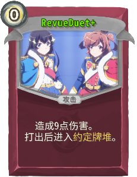 | Common | 攻击 | 0 | 造成 6(9) 点伤害。 打出后进入 约定牌堆 。 |
| 一起吃饭吧 |  | 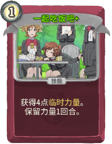 | Common | 技能 | 1 | 获得 3(4) 点 临时力量 。 保留力量 !ShoujoKageki:SM! 回合 。 |
| 上挑 | 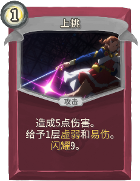 |  | Common | 攻击 | 1 | 造成 5(7) 点伤害。 给予 1(2) 层 虚弱 和 易伤 。 |
| 不再遥不可及 |  |  | Common | 攻击 | 0 | 造成 3 点伤害。 从 约定牌堆 中抽 2(4) 张牌。 |
| 东京塔下 |  |  | Common | 技能 | 1 | 获得 7(11) 点 格挡 。 将 1 张 *约定之塔 放入手牌 消耗 。 |
| 出场 | 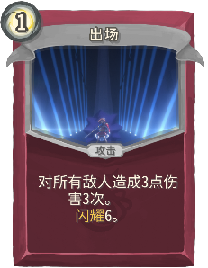 | 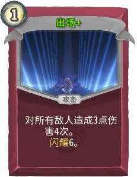 | Common | 攻击 | 1 | 对所有敌人造成 3 点伤害 3(4) 次。 |
| 勇气打击 |  | 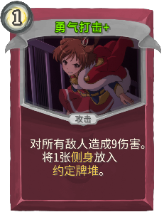 | Common | 攻击 | 1 | 对所有敌人造成 6(9) 伤害。 将 1 张 *侧身 放入 约定牌堆 。 |
| 双人舞 | 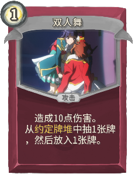 |  | Common | 攻击 | 1 | 造成 10(12) 点伤害。 从 约定牌堆 中抽 1(2) 张牌，然后放入 1(2) 张牌。 |
| 土豆 |  | 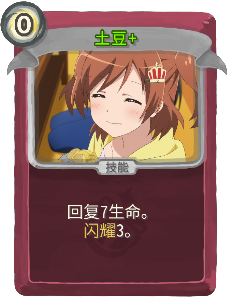 | Common | 技能 | 0 | 回复 4(7) 生命。 |
| 我们的约定 |  | 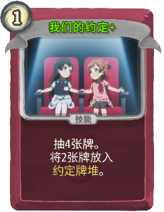 | Common | 技能 | 1 | 抽 3(4) 张牌。 将2张牌放入 约定牌堆 。 |
| 星星串起了我们的友谊 | 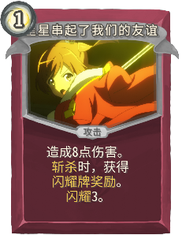 | 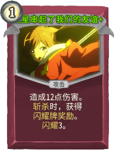 | Common | 攻击 | 1 | 造成 8(12) 点伤害。 斩杀 时，获得 闪耀牌奖励 。 |
| 昨天夜空的光辉 | 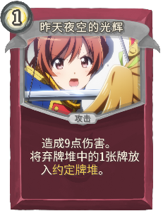 | 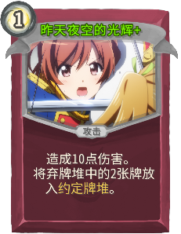 | Common | 攻击 | 1 | 造成 9(10) 点伤害。 将弃牌堆中的 1(2) 张牌放入 约定牌堆 。 |
| 武术练习 | 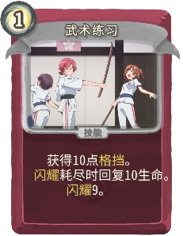 |  | Common | 技能 | 1 | 获得 10(14) 点 格挡 。 闪耀 耗尽时回复 10(14) 生命。 |
| 用你的闪耀贯穿我吧 | 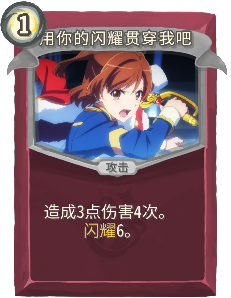 |  | Common | 攻击 | 1 | 造成 3 点伤害 4(5) 次。 |
| 舞动 |  |  | Common | 攻击 | 1 | 造成 9(12) 点伤害。 从 约定牌堆 中选择 2(4) 张牌加入你的手牌。 |
| 蓄力打击 |  | 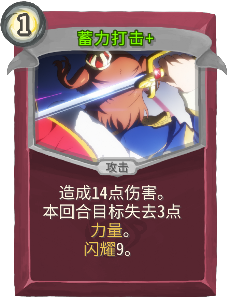 | Common | 攻击 | 1 | 造成 10(14) 点伤害。 本回合目标失去 2(3) 点 力量 。 |
| 观察情况 | 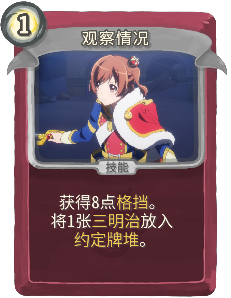 | 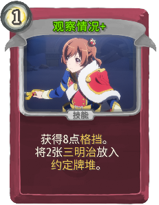 | Common | 技能 | 1 | 获得 8 点 格挡 。 将 1(2) 张 *三明治 放入 约定牌堆 。 |
| 迈向那个舞台 |  | 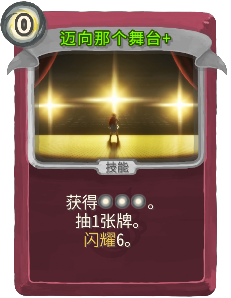 | Common | 技能 | 0 | 获得 [E] [E] [E] 。  (抽 0(1) 张牌。) |
| Banana午餐 |  | 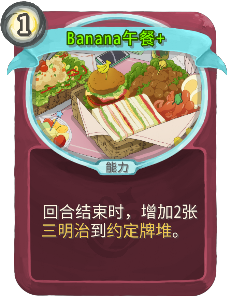 | Uncommon | 能力 | 1 | 回合结束时，增加 1(2) 张 *三明治 到 约定牌堆 。 |
| Banana蛋糕 | 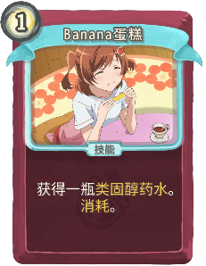 |  | Uncommon | 技能 | 1(0) | 获得一瓶 *类固醇药水 。 消耗 。 |
| Banana费南雪 |  | 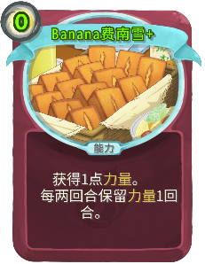 | Uncommon | 能力 | 1(0) | 获得 1 点 力量 。 每两回合保留 力量 1 回合。 |
| Starlight第一幕 | 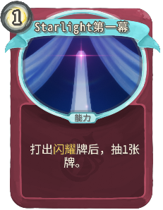 | 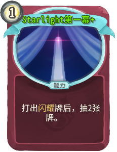 | Uncommon | 能力 | 1 | 打出 闪耀 牌后，抽 1(2) 张牌。 |
| Starlight第三幕 |  |  | Uncommon | 能力 | 1(0) | 获得 闪耀牌奖励 。 |
| 下一个舞台 | 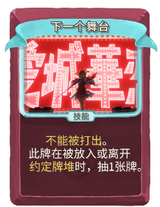 |  | Uncommon | 技能 |  | 不能被打出 。 此牌在被放入或离开 约定牌堆 时，抽 (此牌在牌堆之间移动时，抽) 1 张牌。 |
| 不再犹豫 |  | 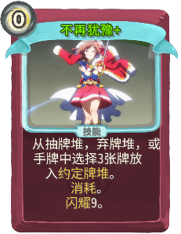 | Uncommon | 技能 | 0 | 从 抽牌堆 ，弃牌堆 ，或手牌 中选择 2(3) 张牌放入 约定牌堆 。 消耗 。 |
| 以觉悟的名义 | 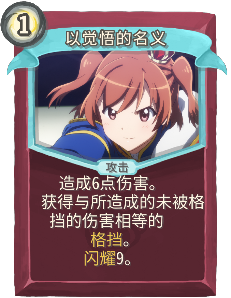 |  | Uncommon | 攻击 | 1 | 造成 6(9) 点伤害。 获得与所造成的未被格挡的伤害相等的 格挡 。 |
| 信封 | 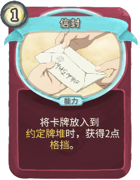 |  | Uncommon | 能力 | 1 | 将卡牌放入到 约定牌堆 时， 获得 2(3) 点 格挡 。 |
| 准备完成 |  | 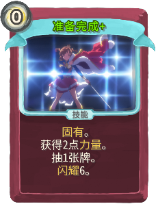 | Uncommon | 技能 | 0 | 固有 。 获得 1(2) 点 力量 。 抽 !ShoujoKageki:SM! 张牌。 |
| 命运交换之日 |  |  | Uncommon | 技能 | 0 | 将手牌与 约定牌堆 中的牌交换。 消耗 。 (not 消耗 。) |
| 我将再次变为我自己 |  | 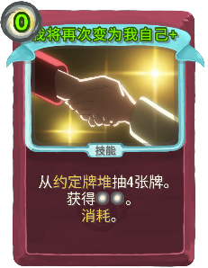 | Uncommon | 技能 | 1(0) | 从 约定牌堆 抽 4 张牌。 获得 [E] [E] 。 消耗 。 |
| 披萨 |  | 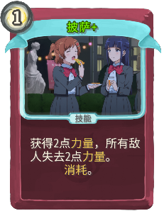 | Uncommon | 技能 | 1 | 获得 1(2) 点 力量 ， 所有敌人失去 !ShoujoKageki:SM! 点 力量 。 消耗 。 |
| 拉伸 |  |  | Uncommon | 技能 | 2 | 获得 14(18) 点 格挡。 打出后进入 约定牌堆 。 |
| 招架 | 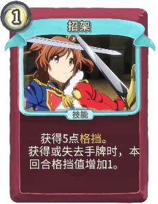 |  | Uncommon | 技能 | 1 | 获得 5(8) 点 格挡 。 获得或失去手牌时，本回合格挡值增加 1 。 |
| 摘星 |  | 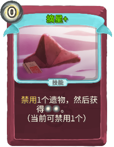 | Uncommon | 技能 | 0 | 禁用 !ShoujoKageki:SM! 个遗物，然后获得 [E] [E] 。 |
| 新的一天 | 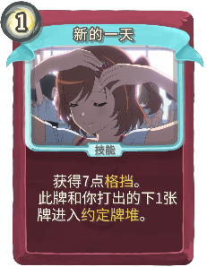 | 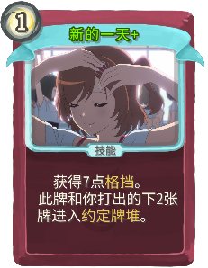 | Uncommon | 技能 | 1 | 获得 7 点 格挡 。 此牌和你打出的下 1(2) 张牌进入 约定牌堆 。 |
| 旋转 |  |  | Uncommon | 攻击 | 1 | 造成 5 点伤害。 此牌在牌堆之间移动时，在本场战斗中伤害增加 2(3) 。 |
| 明年也要在这里相见 |  |  | Uncommon | 技能 | 1 | 获得 5 点 格挡 。 选择保留你的能量 ，手牌， 格挡 ， 或 力量 1(2) 回合。 |
| 星罪 |  |  | Uncommon | 技能 | 0 | 禁用 !ShoujoKageki:SM! 个遗物，然后抽 3 张牌。 |
| 极速下降 |  |  | Uncommon | 技能 | 0 | 从 约定牌堆 中选择 2(3) 张牌放入你的手牌，弃置其余。 |
| 水分补充 |  |  | Uncommon | 技能 | 1(0) | 获得 1 层 缓冲 。 消耗 。 |
| 水族馆 |  |  | Uncommon | 能力 | 1 | (固有 。)  每个回合开始时，抽 1 张牌， 然后将 1 张牌放入 约定牌堆 。 |
| 永无结束的命运舞台 |  |  | Uncommon | 攻击 | 1 | 造成 12(16) 点伤害。 能被多次 升级 。 |
| 激情 |  |  | Uncommon | 技能 | 2(0) | 战斗结束时，获得一个随机遗物 。 |
| 神圣星辰 |  |  | Uncommon | 攻击 | 2 | 造成 18(24) 伤害。 被放入 约定牌堆 时， 在本场战斗中的耗能减少 1 。 |
| 耀眼的阳光 |  |  | Uncommon | 攻击 | 1 | 造成 10(14) 点伤害。 闪耀 耗尽时，可将此牌重新加入牌组。 |
| 背靠背 |  |  | Uncommon | 攻击 | 1 | 造成 约定牌堆 中卡牌数量 4(6) 倍 的 伤害。 （至多计算10张） |
| 舞台正在等待着 |  |  | Uncommon | 能力 | 2(1) |  约定牌堆 被清空时，获得 [E] 。 |
| 舞蹈练习 |  |  | Uncommon | 技能 | 1 | 获得你所有牌 闪耀 值之和的 (值之和+ 0(4) 的) 格挡 。 |
| 落地 |  |  | Uncommon | 攻击 | 1 | 对所有敌人造成 6(9) 点伤害。 将 *回击 放入 约定牌堆 。 |
| 行动 |  |  | Uncommon | 技能 | 1 | 抽 2(3) 张牌。 打出后进入 约定牌堆 。 |
| 重逢 |  |  | Uncommon | 技能 | 1 | 获得 6(9) 点 格挡 。 抽 2 张牌。 将 1 张牌放入 约定牌堆 。 |
| 闪避 |  |  | Uncommon | 技能 | 0 | 获得 3(6) 点 格挡 。 将 *对峙 放入 约定牌堆 。 |
| "宽恕" |  |  | Rare | 攻击 | 2 | 禁用 !ShoujoKageki:SM! 个遗物，然后对所有敌人造成 21(28) 点伤害。 |
| NONNON哒哟 |  |  | Rare | 攻击 | 3 | 对所有敌人造成 12(16) 点伤害，目标本回合失去 12(16) 点 力量 。 |
| Position 0 |  |  | Rare | 能力 | 3(2) | 每回合第 1 次 造成未被格挡的攻击伤害时，获得等量 格挡 。 |
| Starlight第二幕 |  |  | Rare | 能力 | 2 | 打出的 闪耀 牌会额外打出 1(2) 次，然后耗尽 闪耀 值。 |
| 世界上最空虚的人 |  |  | Rare | 能力 | 2(1) | 摧毁抽牌堆，然后以 约定牌堆 代替抽牌堆。 |
| 命运的齿轮 |  |  | Rare | 技能 | 3(2) | 复制 所有手牌 到 约定牌堆 。 消耗 。 |
| 命运舞台的再生产 |  |  | Rare | 能力 | 3(2) | 以无限的 *续演 充满 约定牌堆 。 |
| 唤醒 |  |  | Rare | 技能 | 1 | 从抽牌堆中选择2张牌放入你的手牌。 (从抽牌堆，弃牌堆，或 约定牌堆 中选择2张牌放入你的手牌。) 消耗 。 |
| 投下燃料 |  |  | Rare | 技能 | 0 | 抽 2(3) 张牌。 获得 [E] [E] ([E]) 。 消耗 。 |
| 星光指引 |  |  | Rare | 技能 | 1(0) | 固有 。 将你所有的 闪耀 牌放入 约定牌堆 。 消耗 。 |
| 星光闪耀之时 |  |  | Rare | 技能 | 1 | (保留 。)  耗尽 约定牌堆 之外 你唯一 闪耀 牌，将其打出同等次数。 |
| 最后的台词 |  |  | Rare | 攻击 | 0 | 约定牌堆 之外只有这张牌时才能打出。 对所有敌人造成 999(9999) 点伤害。 |
| 燃烧吧燃烧吧 |  |  | Rare | 能力 | 1(0) | 从 约定牌堆 抽出的牌将被 升级 ， 且被打出时 消耗 。 |
| 皆杀 |  |  | Rare | 攻击 | 1 | 造成 15(18) 点伤害。 闪耀 耗尽时，获得 1(2) 个随机遗物。 |
| 约定之塔桥 |  |  | Rare | 技能 | X | 打出 约定牌堆 顶部 X (X+1) 张牌。 |
| 背负着我们犯下的罪过 |  |  | Rare | 攻击 | 2 | 造成 12(15) 点伤害。 本局游戏中每耗尽一张非同名的 闪耀 牌，伤害增加 4(5) 。 |
| 觉醒形态 |  |  | Rare | 能力 | 3 | 虚无 。 (not 虚无 。) 每个回合开始时，抽满手牌。 |
| 骄傲 |  |  | Rare | 能力 | 4(3) | 固有 ， 期待 。 战斗结束时，获得一个随机遗物。 |

## Potions

| Image | Name | Rarity | Description |
| ----- | ---- | ------ | ----------- |
|  | 闪耀药水 | Common | 从 3 张随机 闪耀牌 中选择 1 张加入你的手牌和牌组。这张牌在本回合耗能变为 0 。 |
|  | 约定药水 | Uncommon | 选择抽牌堆中的一张牌放入 约定牌堆 。这张牌在本回合的耗能变为 0 。 |
|  | 唤醒药水 | Rare | 从任意牌堆中选择卡牌放入手牌，直到手牌达到上限。 |

## Relics

| Image | Name | Rarity | Color | Description | Flavor |
| ----- | ---- | ------ | ----- | ----------- | ------ |
|  | 发夹 | Starter | Karen | 在第二回合开始时，获得一张 #y约定之塔 。 | 小时候与小光两人在东京塔附近的商店中买到的一对发夹中皇冠样式的一枚 |
|  | 水杯 | Common | Karen | 每当你获得 #y闪耀牌 时，使其 #y闪耀 增加 #y1 。 | 贴有青蛙贴纸的水杯，属于大场奈奈。 |
|  | 书签 | Uncommon |  | 在选奖励牌时，可以升级全部卡牌并获取它们。 NL 使用后失效，可通过击杀 #y精英 敌人 重置此遗物。 |  |
|  | 茶杯 | Uncommon | Karen | 每从 #y约定牌堆 取出 #y2 张牌，获得 #y1 #y临时力量 。 |  |
|  | 饼干 | Uncommon | Karen | 拾起时，随机获得 #y普通 ， #y罕见 ， #y稀有 #y闪耀 牌各一张。 |  |
|  | 棒球猫 | Rare | Karen | 每次战斗中，每耗尽一张非同名的 #y闪耀牌 ，获得一个 #y闪耀牌奖励 。 | 露崎真昼喜爱的角色形象。 |
|  | 胶带 | Rare | Karen | 现在你可以在休息处为卡牌添加 #y闪耀 。（最多3次） |  |
|  | 花朵 | Rare |  | 遗物奖励拥有额外一个选项。 |  |
|  | 发夹-立体版 | Boss | Karen | 替换 #r发夹 。 NL 在第一回合开始时，获得一张 #y约定之塔+ 。 |  |
|  | 头盔 | Boss |  | 拾起时，选择一张牌，将其耗能变为0。 |  |
|  | 星之皇冠 | Boss | Karen | 在回合开始时获得 [E] 。 NL 在每个回合开始时， #y禁用 #y2 个 遗物。 | 带来最闪耀Revue的女孩，将被授予星之皇冠，通往TopStar的道路也将为她敞开。 |
|  | 闪耀会员卡 | Shop | Karen | 商店中的所有卡牌获得 #y闪耀 3，且打折 #b50% 。 |  |

| Image | Name |
| ----- | ---- |
|  | 爱城华恋 |

